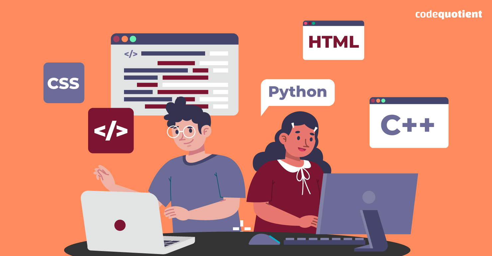

# Hi, I'm Sourya Kumar! 👋

Welcome to my GitHub profile! I'm a passionate developer with a love for technology, creativity, and innovation. Here you'll find an overview of my skills, interests, and projects.

## 🚀 Skills & Technologies

I'm proficient in a variety of programming languages and tools, always ready to turn ideas into reality. Here are some of the skills I bring to the table:

- **Java**
- **HTML**
- **CSS**
- **Python**
- **C++**

## 🌟 My Interests

Beyond coding, I have a diverse range of interests. From diving into literature to exploring the cosmos, there's always something new to discover.

- **Reading**
- **Astronomy**
- **Traveling**
- **Gaming**
- **Music**

## 📬 Get in Touch

Have a project in mind or just want to say hello? Feel free to [drop me a message](mailto:souryakumar399@gmail.com). I'm always excited to connect with fellow enthusiasts!

## 📂 Projects

Explore some of my recent projects that showcase my skills and passion for technology. Each project is a journey in itself, filled with challenges and triumphs.
